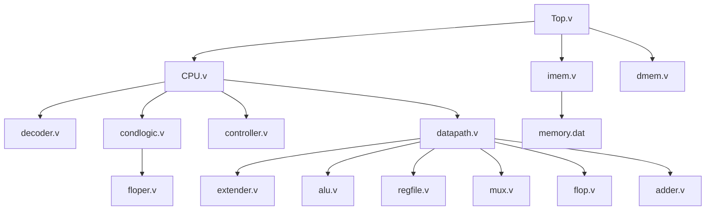

# 32-bit_CPU_Verilog_project
This repository represents my journey of building a 32-bit RISC-V CPU from scratch. As a beginner in CPU design, I followed a step-by-step approach inspired by the amazing workshop hosted by Whyrd, which provided invaluable guidance throughout the process.https://raw.githubusercontent.com/gouthamstantri/32bitCPU_Verilog_project/refs/heads/main/ALUTEST.txt
## GST.v File
Click [here](process.https://raw.githubusercontent.com/gouthamstantri/32bitCPU_Verilog_project/refs/heads/main/ALUTEST.txt) to view the content of `gst.v`.

The files I wrote and its dependencies are as described in the below diagram (top-down approach)

## CPU Instruction Set
As a first project, this CPU design supports a basic set of instructions:

### Data Processing
- ADD  
- SUB  
- AND  
- OR  

### Memory Operations
- LOAD  
- STORE  

### Branch
- BEQ (Branch if Equal)  

The design also includes simple conditional branching based on RISC-V architecture basics.

---

## Microarchitecture Overview

### Top-Level View
Here's my initial rough diagram of the top-level CPU architecture:

### Detailed Microarchitecture
As I progressed through the workshop, I developed a better understanding of how each component fits into the design:

### Controller
The controller was particularly challenging but rewarding to implement. It handles instruction decoding and signal generation:

### Decoders
The decoders were another interesting part of the design, responsible for generating control signals:

---

## Verilog Module Integration
I learned to break the design into smaller modules for easier management and testing. The main components are:

### `datapath.v`
This module integrates the key components of the CPU's datapath:

### `controller.v`
This module generates control signals and integrates with the instruction decoder:

### `cpu.v`
This module combines the `datapath.v` and `controller.v` to form the CPU core.

### `top.v`
This module integrates the CPU with instruction and data memory (`imem.v` and `dmem.v`).

---

## Testing
Testing was one of the most fulfilling parts of this project. It helped me validate my design and ensure everything was working as expected.

### Test Code
I used a simple test program to validate the CPU's functionality. The program exercises all instructions and checks for a correct result:

### Testbench Files
- `imem.v`: Contains the instruction memory with the test program in hexadecimal format.
- `testbench.sv`: Simulates the CPU and verifies if the expected result (e.g., `mem[84] == 7`) is achieved.

### Component-Level Testing
To ensure reliability, I tested each module independently:
- `aluTest.v`: Testbench for the ALU module.
- Additional testbenches for other modules will be added soon.

---

## Acknowledgment
This project was made possible thanks to the workshop hosted by Whyrd and the guidance provided by **Rajdeep Mazumder**. Their expertise and resources helped me better understand CPU design and motivated me throughout this journey. 

